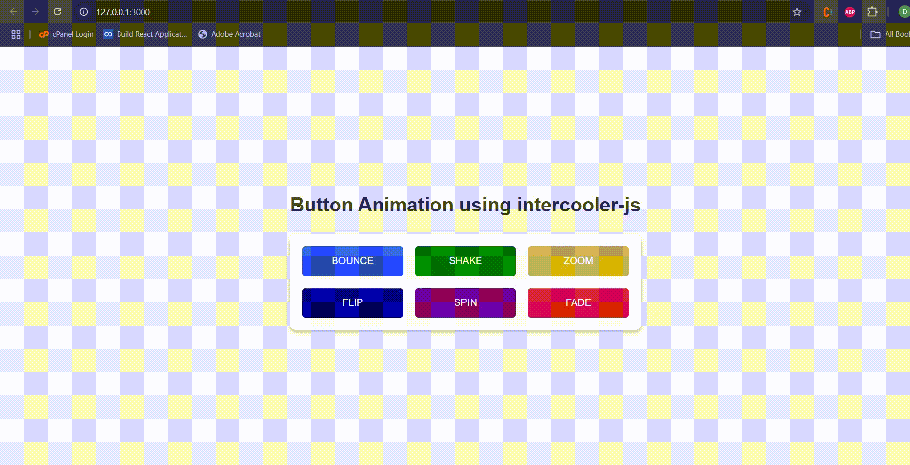

# intercooler.js  Examples
This repository contains four practical examples to demonstrate the capabilities of 
# 1.Employee Form
### Description
This example demonstrates how to submit a form and display the server's response dynamically without refreshing the page. Useful for creating quick and responsive CRUD interfaces.
### Code Snippet 
- **HTML**
<form ic-post-to="/employee/add" ic-target="#responseMessage">
  <label for="name">Name:</label>
  <input type="text" id="name" name="name" required>
  <label for="email">Email:</label>
  <input type="email" id="email" name="email" required>
  <button type="submit">Add Employee</button>
</form>

- **node.js**
  app.post('/employee/add', (req, res) => {
  const { name, email } = req.body;
  if (name && email) {
    res.status(200).send(`Employee ${name} added successfully!`);
  } else {
    res.status(400).send('Invalid input!');
  }
});
# 2.Infinite Scroll 

### Description

This example demonstrates how to load more content dynamically as the user scrolls down the page.

### Code Snippet 
- **HTML**

  
Loading...

# 3.polling  

### Description

This example demonstrates how to update a specific section of the page automatically at regular intervals.

### Code Snippet 
- **HTML**

  
Polling data will appear here every 5 seconds.

# 4.Button Transition Effects 

### Description

This example demonstrates how to implement smooth button transitions and animations using **Intercooler.js**. It integrates CSS transitions and animations to create dynamic and interactive button effects that are updated seamlessly through AJAX calls.

### Code Snippet 
- **HTML**
 <button id="animatedButton" class="btn" ic-get-from="/api/animation" ic-trigger="click" ic-target="#animatedButton">
    Click Me!
  </button>

 **css**
    .btn {
      padding: 10px 20px;
      font-size: 16px;
      cursor: pointer;
      transition: all 0.5s ease-in-out;
      background-color: rgb(43, 80, 231); 
    }
.btn.ic-transitioning {
  transform: scale(1.1); /* Slight zoom effect */
  background-color: #3b5998; /* Change button color */
  color: white; /* Change text color */
}
# How to Run the Project
## Install Dependencies
You can add **intercooler.js** to your project either by using a CDN or installing it via npm.

1.Using CDN

2.Make sure you have Node.js installed. Then, install the required package:
       -npm install express

## Start the Server
1.create server.js  to handle requests
2.Run the following command to start the server:
       node server.js

## Demos

1. **Employee Form**:

2. **Infinite scroll**: 

3. **polling**:

4. **Button Transition**:

